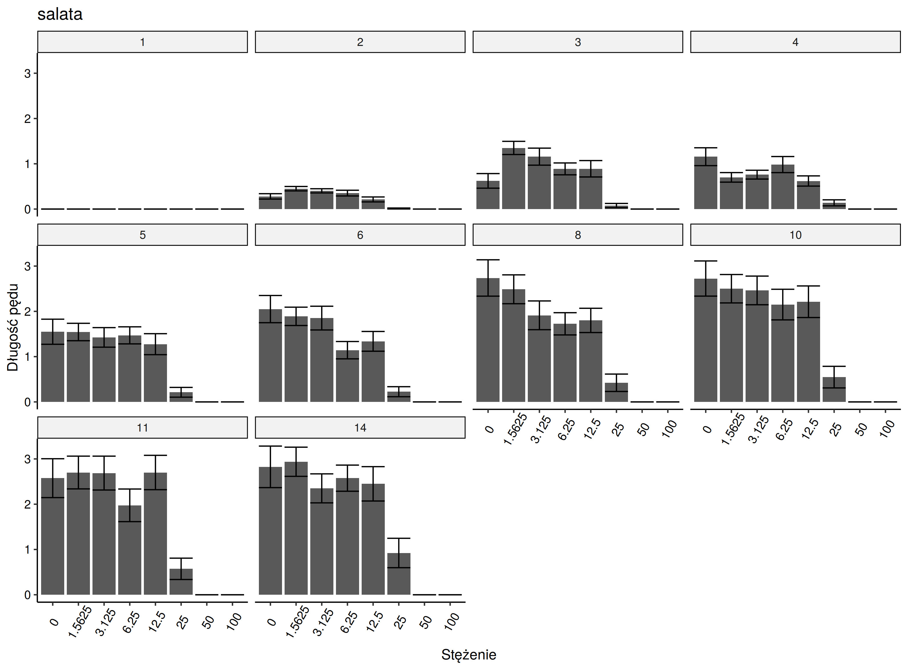

### olga_plants
## Wykresy część I
Poniżej przedstawiono wykresy przedstawiające długości łodygi w zależności od stężenia wyciągu wodnego dla poszczególnych gatunków roślin. Wykresy są pogrupowane zmienną kategoryczną oznaczającą dzień pomiaru, przedstawioną w ramce nad wykresem.

Ze względu na nieścisłości w danych (mniejsze wartości długości łodygi dla kolejnych dni bądź braki danych) zaprzestano dalszej analizy dla gatunków: 

- burak,
- rzepak,
- sałata,
- sosna.
