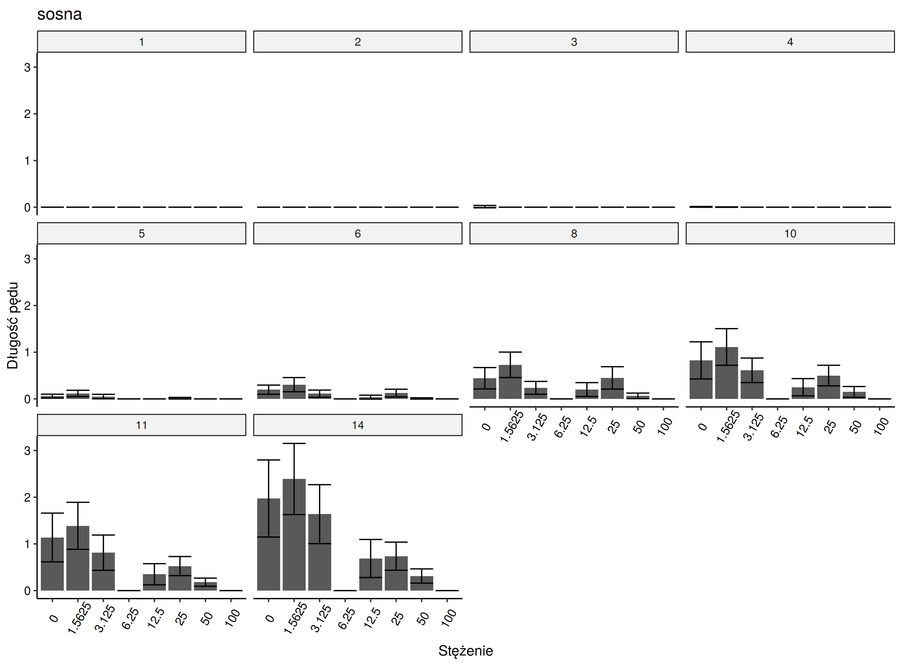

## Olga kiełkowanie
### Ocena jakości zmiennych
Poniżej przedstawiono wykresy przedstawiające średnie arytmetyczne z długości łodygi w zależności od stężenia wyciągu wodnego dla poszczególnych gatunków roślin oraz 95% przedział ufności dla średniej. Wykresy są pogrupowane zmienną kategoryczną oznaczającą dzień pomiaru, przedstawioną w ramce nad wykresem.

Ze względu na nieścisłości w danych (mniejsze wartości długości łodygi dla kolejnych dni bądź braki danych) zaprzestano dalszej analizy dla gatunków: 

- burak,
- rzepak,
- sałata,
- sosna.

W trakcie analizy wykresów należy także zauważyć wysokie wartości 95% przedziału ufności dla gatunków owies i jęczmień, co w następstwie może skutkować nieistotnymi wynikami testów statystycznych opartych na średniej arytmetycznej.

### Normalność rozkładu zmiennych

Zmienne zostały ocenione pod kątem zgodności z rozkładem normalnym za pomocą testu Shapiro-Wilka. Zostały wykonane wwykresy kwantyl-kwantyl (ang. *qq plots*) obrazujące zgodność danych z rozkładem normalnym. Na podstawie przeprowadzonego testu we wszystkich przypadkach odrzucono hipotezę zerową o zgodności danych z rozkładem normalnym. Z tego powodu do dalszej analizy wybrano testy  nieparametryczne.

